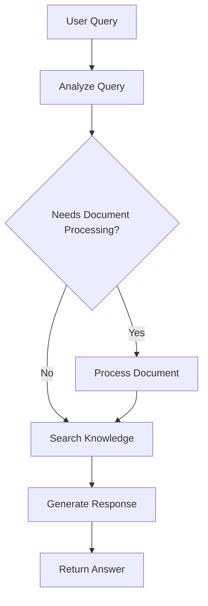

# Multimodal RAG Agent

This directory contains the LangGraph-based agent for the multimodal RAG application.

## Features

- **LangGraph Integration**: Uses LangGraph for structured agent workflows
- **Ollama Support**: Integrates with Ollama for local LLM inference
- **Document Processing**: Processes PDF documents using Docling
- **Vector Search**: Performs similarity search using Milvus
- **Interactive CLI**: Provides command-line interface for user interaction

## Architecture

The agent follows a LangGraph workflow with the following nodes:

1. **analyze_query**: Analyzes user input to determine required actions
2. **process_document**: Processes new documents using DoclingPDFProcessor
3. **search_knowledge**: Searches vector database for relevant information
4. **generate_response**: Generates final response using retrieved context

## Usage

### Interactive Mode

```bash
python main.py
```

### Single Query

```bash
python main.py --query "What is the main topic in the documents?"
```

### Add Document

```bash
python main.py --add-document "path/to/document.pdf"
```

### Show Statistics

```bash
python main.py --stats
```

## Requirements

- Ollama running on `http://localhost:11434`
- Milvus running on `http://localhost:19530`
- Python 3.12+

## Configuration

The agent uses the main `config.yaml` file with the following sections:

```yaml
# Agent Configuration
agent:
  ollama_base_url: "http://localhost:11434"
  temperature: 0.1
  max_retries: 3
  timeout: 30
```

## Testing

Run the test suite:

```bash
python run_tests.py
```

Run specific tests:

```bash
python run_tests.py test_analyze_query
```

## Agent Workflow



## Error Handling

The agent includes comprehensive error handling for:

- Ollama connection failures
- Milvus database errors
- Document processing failures
- Invalid file paths
- Network timeouts

## Examples

### Adding a Document

```python
from src.agent import MultimodalRAGAgent

agent = MultimodalRAGAgent()
result = agent.add_document("documents/report.pdf")
print(f"Processing result: {result}")
```

### Querying Knowledge

```python
response = agent.process_query_sync("Summarize the key findings")
print(f"Answer: {response.answer}")
print(f"Sources: {len(response.sources)}")
```

### Async Usage

```python
import asyncio

async def main():
    agent = MultimodalRAGAgent()
    response = await agent.process_query("What are the main conclusions?")
    print(response.answer)

asyncio.run(main())
```